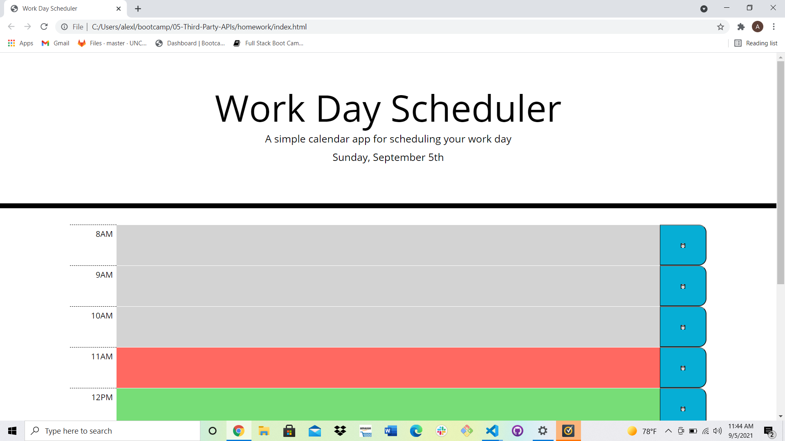

# Day-Planner

## Your Task

This application allows the user to plan out their day by the hour. The color of each field will change based off of whether the time slot is in the past, present, or future.

A preview of the working application:

## Link to working application:

https://alexbrandon3.github.io/day-planner/

